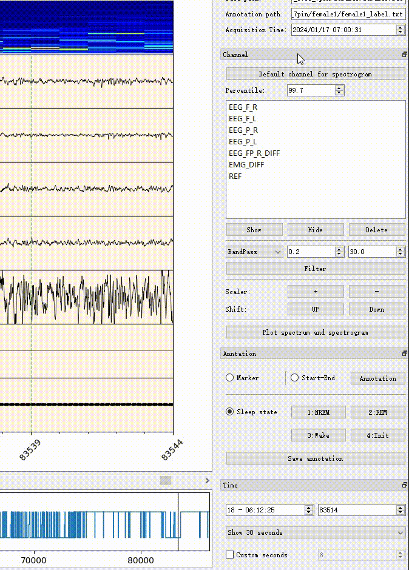
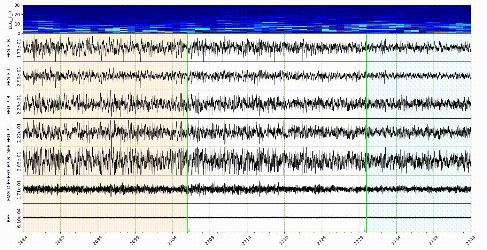
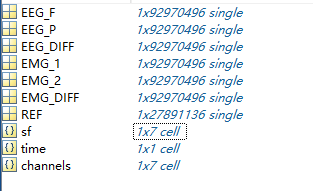

# MiSleep
MiSleep is for EEG/EMG signal processing and visualization


## Get start
```shell
pip install misleep
```

Find the directory where you installed misleep, run
```shell
python -m misleep
```

See [https://bryanwang.cn/MiSleep/](https://bryanwang.cn/MiSleep/) for a simple documentation.

### New features
1. New data structure

You can save the original data as a new data structure (See `Data save protocol`).
Where you can add the channels' name, sampling rate and the acquisition time into 
the original data.

2. Annotate more details

Here we provide the start_end mode as a more precise way to annotate the event such
as Slow Wave Activities or Spindle, e.t. You can select the `Start-End` mode in
the Annotation tool dock and click wherever in the signal area to annotate the 
event.

3. Tool bar dock



Now you can move the toolbar to wherever you want.

4. Color for state



Different color background for different sleep states. Now the color map is:

Init: White; NREM: Orange; REM: Blue; Wake: Red.

5. Event Detection

For sleep spindle and sleep slow-wave activities detection, you can check the tools menu for event detection. The auto stage will coming soon.

6. Self-define `config.ini`

There is a config.ini in the root directory of MiSleep source package, multiple parameters can be self define there, check [config.ini](https://bryanwang.cn/MiSleep/#config-file) for detail.

**Future**: Auto stage. Open for suggestions :).


## Data save protocol
You need to use matlab for data saving, the final data should be a structure.


If you are using TDT for recording, here is the example script to save the data.
```matlab
tdt_data = ...

data.EEG_F = tdt_data.streams.EEG1.data(1, :);
data.EEG_P = tdt_data.streams.EEG1.data(2, :);
data.EEG_DIFF = data.EEG_F - data.EEG_P
data.EMG_1 = tdt_data.streams.EMG1.data(1, :);
data.EMG_2 = tdt_data.streams.EMG1.data(2, :);
data.EMG_DIFF = data.EMG_1 - data.EMG_2;
data.REF = data.streams.mou1.data(1, :);
data.channels = {'EEG_F' 'EEG_P' 'EEG_DIFF' 'EMG_1' 'EMG_2' 'EMG_DIFF' 'REF'};
data.sf = {305.1758 305.1758 305.1758 305.1758 305.1758 305.1758 305.1758};
data.time = {'20240409-18:00:00'};  
```
And an example of result data:


