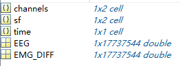
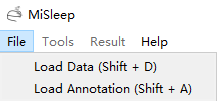
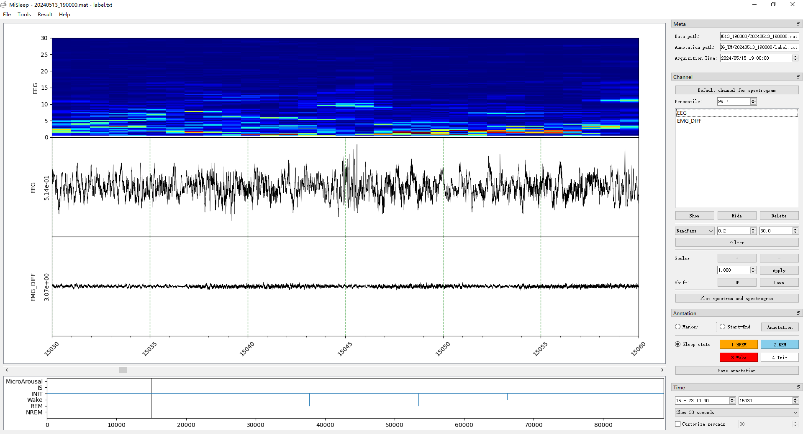
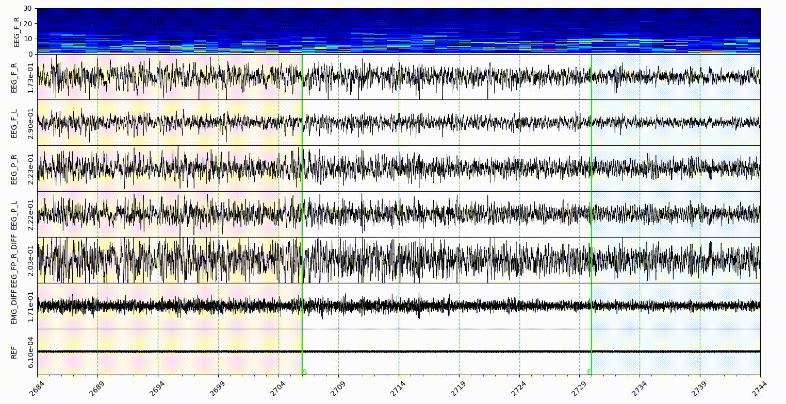

# [MiSleep](#misleep)
MiSleep is for EEG/EMG signal processing and visualization.

The name MiSleep is from '**Mi**ce **Sleep**' and also sounds like 'my sleep'.


Here we only introduce the GUI of MiSleep. [Github repo](https://github.com/BryanWang0702/MiSleep)

## Table of Contents

- [MiSleep](#misleep)
  - [Table of Contents](#table-of-contents)
  - [Get start](#get-start)
  - [Basic usage](#basic-usage)
    - [Prepare work](#prepare-work)
      - [1. Data file](#1-data-file)
      - [2. Annotation file](#2-annotation-file)
    - [Preview data](#preview-data)
    - [Visualization part](#visualization-part)
    - [Tool part](#tool-part)
      - [Meta dock](#meta-dock)
      - [Channel dock](#channel-dock)
      - [Annotation dock](#annotation-dock)
        - [Marker](#marker)
        - [Start-End](#start-end)
        - [Sleep state](#sleep-state)
      - [Time dock](#time-dock)
    - [Menu tool](#menu-tool)
      - [Tools](#tools)
      - [Result](#result)
  - [Config file](#config-file)
  - [Install MiSleep](#install-misleep)

## [Get start](#get-start)
```shell
pip install misleep

# Or use 
pip install --upgrade misleep 
# to update the latest version
```

Find the directory where you installed misleep, run
```shell
python -m misleep
```

## [Basic usage](#basic-usage)

### [Prepare work](#prepare-work)
#### [1. Data file](#1-data-file)
Here we suggest to use `.edf` or `.mat` format data. `EDF` is the `European Data Format`. `MAT` is the data format from `matlab`. Consider that `EDF` is a standard data format (see [edfplus](https://edfplus.info/)), here we only show how to grab the `MAT` format data for MiSleep (use `data.mat` for example).

`data.mat` should be a structure of matlab, each channel of data shoulf be a column/row of single/double data. And `channel` argument contains the channel names for each channel data. The `sf` argument contains the sample rates for each channel data. `time` is the acquistion time of the data. See example below.



#### [2. Annotation file](#2-annotation-file)
About annotation file, you need to create a new `.txt` file.

### [Preview data](#preview-data)
Load data and annotation files using the `File` menubar, or use shortcut.



MiSleep will show the data and annotation automatically after the loading.



The window contains with two parts, the visualization part and tool part.

### [Visualization part](#visualization-part)
Three main panels, the spectrogram panel, the signal panel and hypnogram panel.

### [Tool part](#tool-part)
#### [Meta dock](#meta-dock)
Here we display the meta infomation of your data, including the data path, annotation path and data acquisition time.

#### [Channel dock](#channel-dock)
These tools are based on one/multiple channel data. **Default channel for spectrogram** can set the selected channel for spectrogram, and the **percentile** editor can set the percentile of spectrogram heatmap. 

Then it's **List View for Channel**, it will display all the channel names, and you can select one or multiple channel for the following operations. Notice that some tools are only based on one channel, e.g., **Default channel for spectrogram**. The **three buttons (`Show`, `Hide`, `Delete`)** can do the corresponding operations with channel list.

Four kinds of basic **filter** can be applied to channel data, the filter functions are done with `scipy.signal.filtfilt`.

**Scaler and shift** part can adjust the channel visualization, zoom up/down or shift up/down the channel selected.

**Plot spectrum and spectrogram** is not only based on the selected channel, also need to select a `start-end` area in `sleep state annotation mode`, see [Annotation dock](#annotation-dock).

#### [Annotation dock](#annotation-dock)
There are three modes of annotation: **Marker**, **Start-End**, **Sleep state**, with three radios.

##### [Marker](#marker)
Single time point annotaion, will pop up a dialog to choose which annotation to apply.

##### [Start-End](#start-end)
Choose a start end area in **ms** level, so there are more precise event can be annotated. After choosing start end area, use the **Annotation** button or `a` for shortcut, you can choose a label for the selected start end area. Different start end area can overlap.

##### [Sleep state](#sleep-state)
A roughly mode campare to `Start-End` mode, the temporal resolution is `s`. And no overlap between states. The default states here are **NREM**, **REM**, **Wake**, **Init**, and you can self-define other state in the [config.ini](#config-file) file. Different state will display as different color (relate to the button color and the color set in `config.ini`) in the visualization part.

#### [Time dock](#time-dock)
Time configuration for signal visualization part. The absolute timestamp based on the acquisition time. The second time relative to the start time. These two can help you locate the time point.

The **dropbox** can select the time range to show of current window. And the custom editor can set the second for the time range of current window.

### [Menu tool](#menu-tool)
#### [Tools](#tools)
**Add Line** can add horizontal line in the channel signal of visualization part.

**Event Detection** can detect the SWA (Slow-Wave) activities and Spindle activities based on selected channel data.

#### [Result](#result)
**Transfer Restult** can transfer the annotation file (.txt) to a excel file, which is more convenient for downstream analysis.

**State Spectral** can exoprt the spectral of different states in the `sleep state` mode.

## [Config file](#config-file)
We use `config.ini` for MiSleep configuration. It's under the misleep project folder, you can easily find and self-define it.

The default of config file is as followed:
```ini
[gui]
version = XXXXX
updatetime = XXXXXX
marker = ['slow_wave', 'add water', 'third']
startend = ['NREM', 'REM', 'Wake', 'Spindle', 'SWA', 'start end label', 'start end label']
statemap = {"1": "NREM", "2": "REM", "3": "Wake", "4": "INIT", "5": "IS", "6": "MicroArousal"}
statecolor = {"1": "orange", "2": "skyblue", "3": "red", "4": "white", "5": "green", "6": "pink"}
startendcolor = {"NREM": "orange", "REM": "skyblue", "Wake": "red"}
statecolorbgalpha = 0.1
markerlinecolor = "red"
startendlinecolor = "blue"
openpath = E:
```

The **marker** and **startend** list contains the annotations in the **Marker** and **Start-End** mode respectively.

The **statemap** and **statecolor** is for **Sleep state** mode. The number should be an ascending integer start from 1, and support 9 states at most. The number is for the shortcut of state annotate, and for hypnogram plot. The color in **statecolor** dict, is the color of each state display in the signal area of visualization part. See gif below.



**Note**: only the *NREM*, *REM*, *Wake* and *Init* got the button in the sleep state annotaion area, the other states in the statemap can only annotate with shortcut, which is the number of them.

**statecolorbgalpha** is the alpha value of state color, which is the degree of transparency.

**startendcoloe** is the color of lines in the **Start-End** mode, relate to the **startend** list here.

**markerlinecolor** and **startendlinecolor** are the default line color for **Marker** and **Start-End** mode respectively.

**openpath** is the default path to open in the MiSleep GUI, and after each browser, the path will update.

## [Install MiSleep](#install-misleep)
To install misleep, you need to download the [miniconda](https://docs.anaconda.com/miniconda/), for windows only download [this](https://repo.anaconda.com/miniconda/Miniconda3-latest-Windows-x86_64.exe) and install it. 

1. Create a new environment with conda. Open the cmd (terminal if you use macOS), use the following commands:
```shell
# Create a environment for misleep
conda create -n misleep python=3.9
# activate the environment
conda activate misleep
# install the misleep
pip install misleep
```

2. Now you can use the misleep by commands.
```shell
# enter the path you install the misleep
# First you need to enter the disk you install miniconda, like me 'E:', so I just enter E:
E:
# Go to the directory you install miniconda
cd PATH_YOU_INSTALL_MINICONDA
# Go to the directory you install misleep, if you are already in the miniconda path
cd envs/misleep/Lib/site-packages
# Use python to run misleep
python -m misleep
```

3. For quickly start misleep, you can write a script, just create a new .txt file, and enter the following contents:
```shell
# go to the directory you installed misleep
E:
cd PATH_YOU_INSTALL_MINICONDA/envs/misleep/Lib/site-packages
call conda activate misleep
python -m misleep
```
Save the file and change the extension name to .bat or .cmd, then you can open it by double click.

:)
